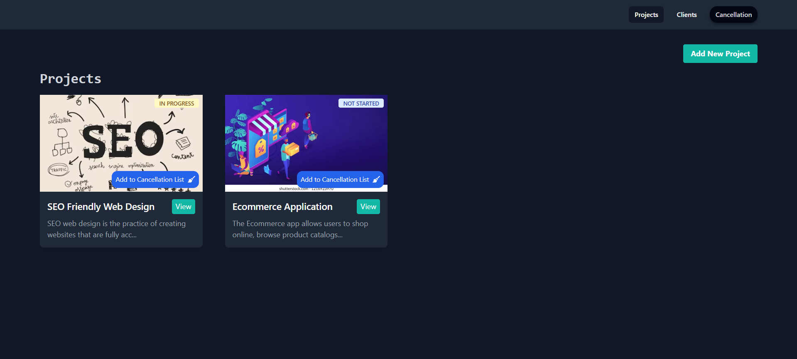
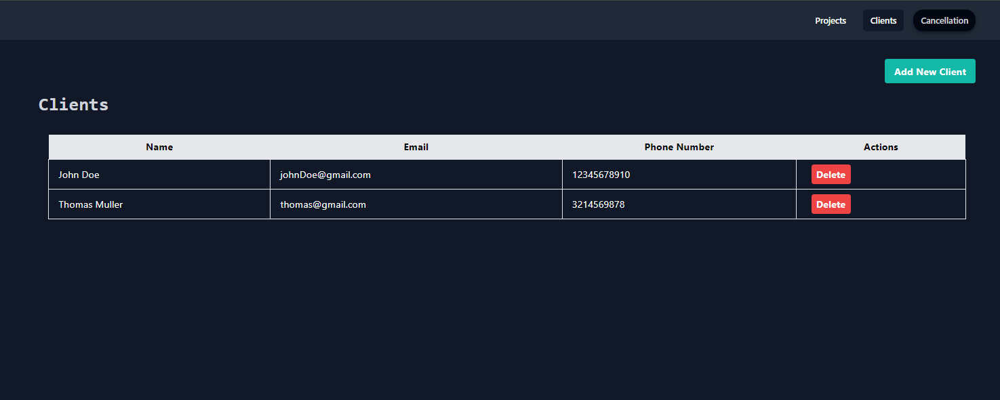
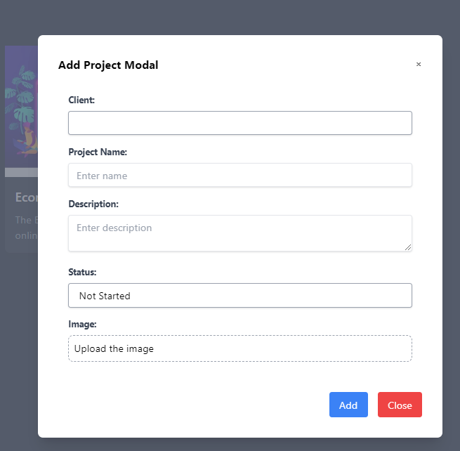
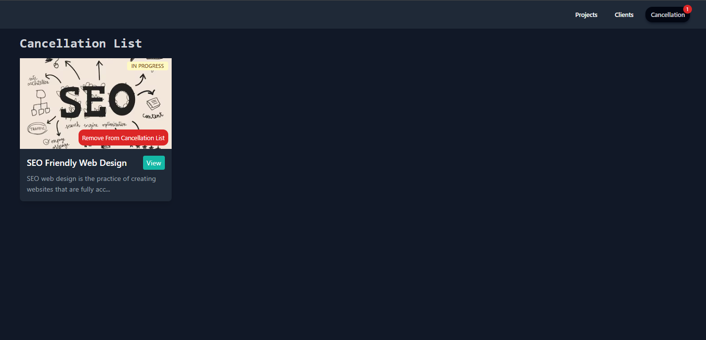
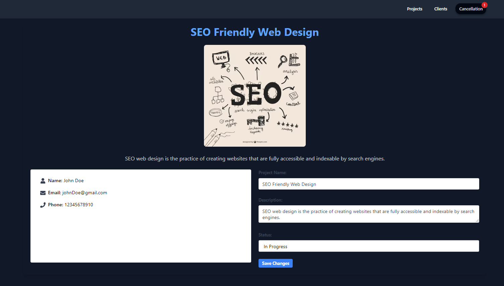

<div align="center">
<h3 align="center">Project Manage</h3>
</div>

<details open>
  <summary>Table of Contents</summary>
  <ol>
    <li>
      <a href="#about-the-project">About The Project</a>
    </li>
     <li>
      <a href="#built-with">Built With</a>
    </li>
    <li>
      <a href="#getting-started">Getting Started</a>
    </li>
  </ol>
</details>

## About the project

Project Manage is a lightweight project management tool designed with a focus on simplicity and learning GraphQL.The tool enables users to manage projects, track project statuses, add clients, and assign clients to specific projects.

Features:

- Created the application on <strong>React</strong>, <strong>Vue</strong> and using <strong>GraphQL</strong>.
- Create new projects
- Add Clients and assign the project according to the clients
- View the project in detail can edit the information of the project.
- Change the status of the project and also keep track of the cancelled projects.

<div style="display: flex; flex-direction: row;">
    
    
</div>

<div style="display: flex; flex-direction: row; margin-top: 10px">
    
    
</div>


<div style="display: flex; flex-direction: row; margin-top: 10px">
    
</div>

## Built With

<a href="#"></a>

<a href="#"></a>


<p align="right">(<a href="#readme-top">back to top</a>)</p>

<!-- GETTING STARTED -->

## Getting Started

This section describes how you can setup the project locally. To get the local copy up and running follow these simple steps.

1. Clone the repo
   ```sh
   git clone https://github.com/your_username_/Project-Manage.git
   ```

2. Navigate to the server folder and run the backend server 

   ```sh
   cd server
   npm install
   npm run dev
   ```

3. To run the React Client navigate to the client-react and execute following command

   ```sh
   cd client-react
   npm install
   npm run dev
   ```

4. To run the Vue Client navigate to the client-vue and execute the following command

    ```sh
    cd client-vue
    npm install
    npm run serve
    ```

